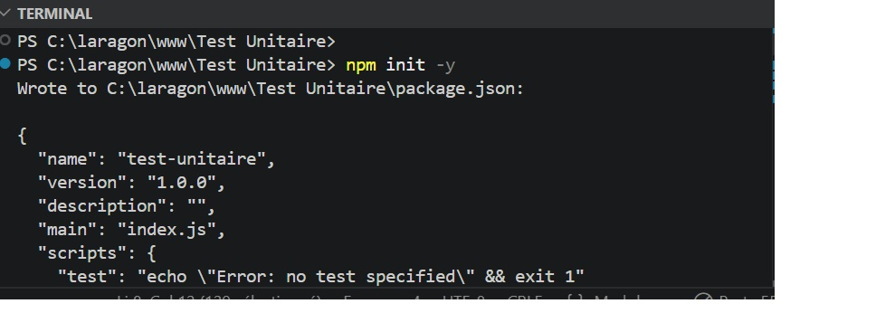
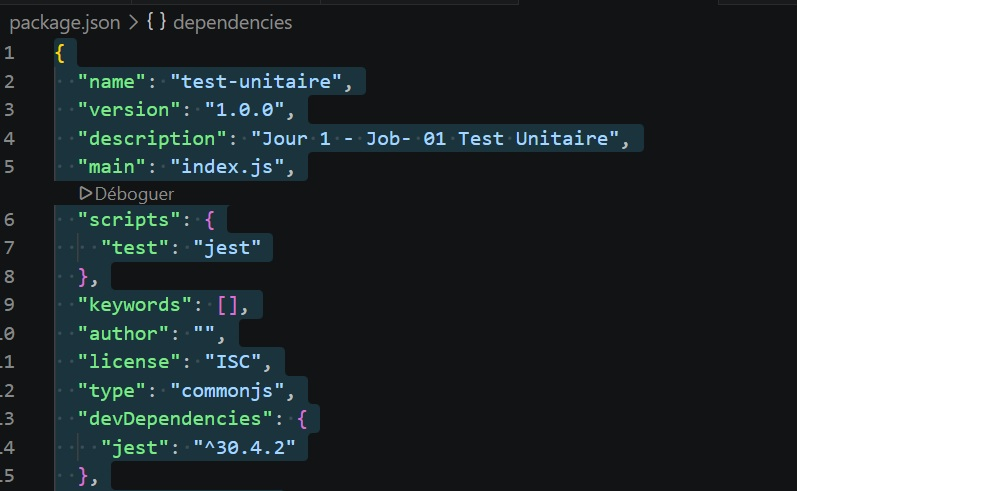
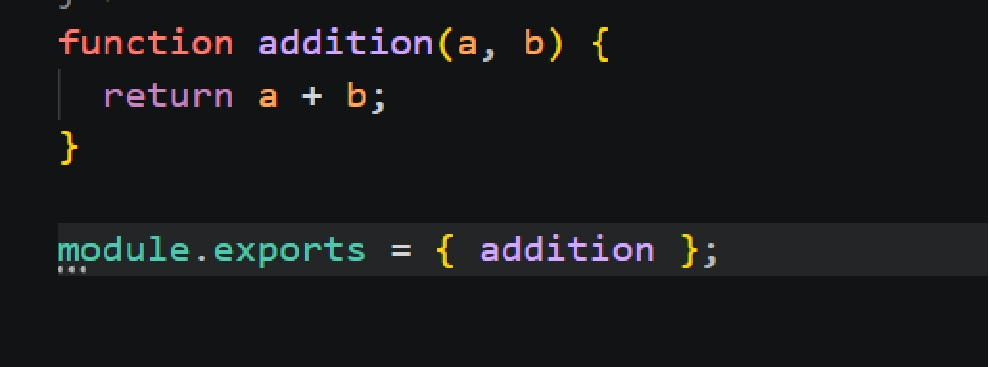
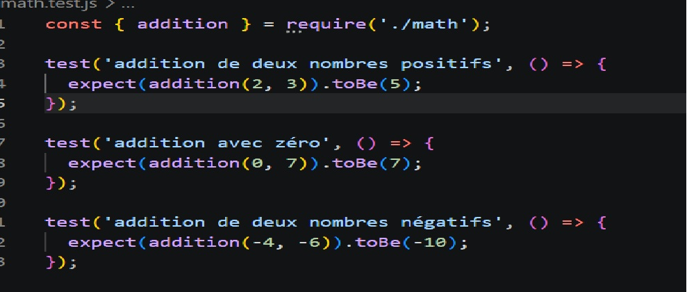
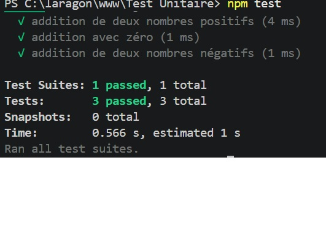
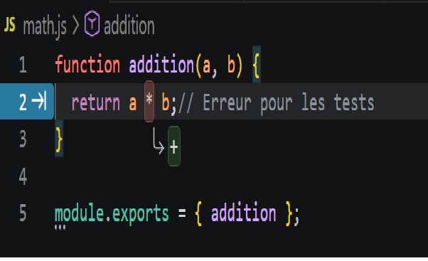
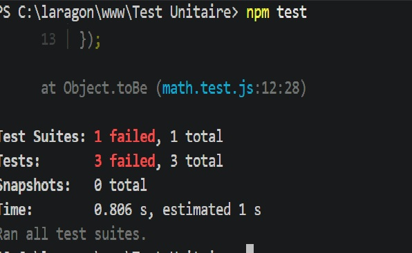
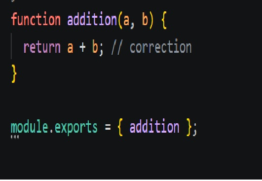
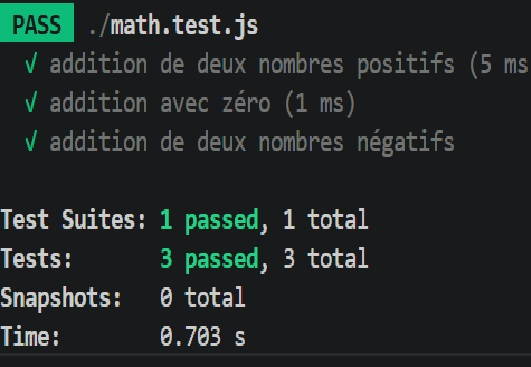

 Jour 1 - Job 01 - Test Unitaire avec Jest

1. Initialiser le projet Node.js
Commande pour créer le fichier `package.json` automatiquement :

npm init -y

 2. Installer Jest
Commande pour installer Jest en dépendance de développement :

npm install --save-dev jest

 3. Configurer Jest dans package.json
Commande pour définir Jest comme outil de test :

npm pkg set scripts.test="jest"

 4. Créer la fonction addition dans math.js
Fonction qui additionne deux nombres et retourne le résultat :

 5. Créer les tests dans math.test.js
Tests unitaires écrits avec la syntaxe Jest :

 6. Lancer les tests - résultat vert

npm test

 7. Introduction d'une erreur volontaire
Modification du `+` en `*` dans math.js pour simuler un bug :

 8. Résultat des tests en échec
Les tests détectent immédiatement le bug :

 9. Correction du bug
Remise du `+` dans math.js :

 10. Tests finaux - résultat vert

npm test

